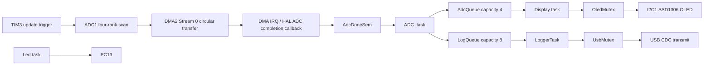
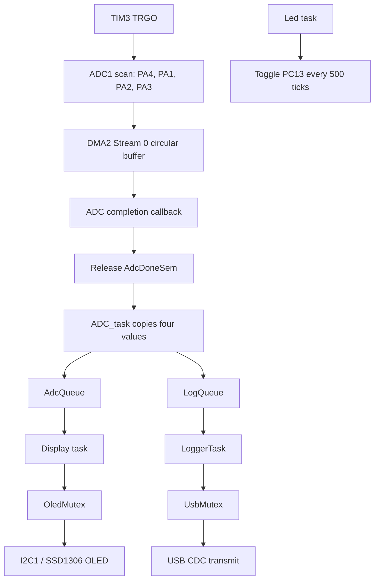

# STM32F4 FreeRTOS ADC DMA Monitor with OLED and USB CDC

## Overview

`ADC_OLED` is an STM32F401-based embedded application that combines timer-triggered multi-channel ADC acquisition, circular DMA, CMSIS-RTOS2 APIs backed by FreeRTOS, an SSD1306 OLED display, USB CDC logging, and a periodic LED task. It is useful as a compact example of moving peripheral work through RTOS tasks and queues while protecting shared peripheral access with mutexes.

The implementation is generated from STM32CubeMX and built as an STM32CubeIDE project. The application logic is in `Core/Src/main.c`; the RTOS-generated `Core/Src/freertos.c` file does not add separate application tasks.

## Key Features

- STM32F401CCU6 target using STM32 HAL.
- ADC1 scans four analog inputs using a timer trigger.
- ADC results are transferred to a four-element `uint16_t` buffer by DMA2 Stream 0 in circular mode.
- ADC DMA completion releases a binary semaphore to the ADC task.
- ADC samples are sent to a display queue and formatted log messages are sent to a USB log queue.
- SSD1306-compatible 128x64 OLED driver over I2C1.
- USB Full-Speed device configured with the CDC class.
- Separate RTOS tasks for ADC acquisition, display updates, USB logging, LED control, and the generated default task.
- OLED and USB access are protected by separate mutexes.

## Hardware

| Component | Verified configuration |
|---|---|
| MCU | STM32F401CCU6, STM32F4 family, UFQFPN48 package |
| Analog inputs | PA1 / ADC1_IN1, PA2 / ADC1_IN2, PA3 / ADC1_IN3, PA4 / ADC1_IN4 |
| OLED interface | I2C1, PB6=SCL and PB7=SDA, configured for 400 kHz |
| OLED driver | SSD1306-compatible driver, 128x64 framebuffer, address constant `0x78` |
| USB | USB OTG FS in device-only mode, USB CDC class, PA11=DM and PA12=DP |
| LED GPIO | PC13 push-pull output, toggled by the `Led` task |
| ADC DMA | DMA2 Stream 0, Channel 0, peripheral-to-memory, circular, high priority |
| External clock | HSE enabled; the `.ioc` records a 25 MHz HSE value |

The repository does not identify a specific evaluation board, OLED module, analog source, or external programmer/debug probe.

## Software Stack

- STM32CubeIDE project using the GCC toolchain.
- STM32CubeMX configuration version 6.17.0.
- STM32Cube FW_F4 package 1.28.3.
- STM32 HAL drivers, including ADC, DMA, GPIO, I2C, timer, USB PCD, and RCC modules.
- FreeRTOS kernel 10.3.1 as identified in `Core/Inc/FreeRTOSConfig.h`.
- CMSIS-RTOS2 API (`cmsis_os.h`) over FreeRTOS.
- STM32 USB Device Library CDC class.
- C application code with the STM32 startup assembly file.
- Local SSD1306 and font components in `Core/Inc` and `Core/Src`.

## RTOS Architecture

The application uses CMSIS-RTOS2 objects created before `osKernelStart()`. The ADC task starts the ADC DMA stream and TIM3, waits for the ADC completion semaphore, copies the DMA buffer into an `AdcMessage_t`, and publishes it to both queues. The display task consumes ADC messages. The logger task consumes formatted log messages and transmits them through USB CDC. The LED task runs independently.



The `defaultTask` is created but calls `osThreadExit()` immediately. No application task is implemented in `freertos.c`.

## Tasks

CMSIS-RTOS2 `priority` values are the values configured in the source. Stack sizes below are the byte values passed through the generated `N * 4` expressions in `main.c`.

| Task | Priority | Stack Size | Responsibility |
|---|---:|---:|---|
| `defaultTask` / `StartDefaultTask` | `osPriorityNormal` (24) | 512 bytes | Calls `osThreadExit()`; USB initialization is commented out here. |
| `ADC_task` / `startADC` | `osPriorityAboveNormal` (32) | 2048 bytes | Starts ADC DMA and TIM3, waits on ADC completion, copies samples, and posts ADC/log messages. |
| `Display` / `StartDisplay` | `osPriorityNormal` (24) | 3072 bytes | Initializes and refreshes the SSD1306 display from `AdcQueue`. |
| `LoggerTask` / `StartLogger` | `osPriorityNormal` (24) | 3072 bytes | Initializes USB CDC and transmits messages received from `LogQueue`. |
| `Led` / `StartLow` | `osPriorityLow` (8) | 2048 bytes | Toggles PC13 and waits until the next 500-tick deadline. |

The RTOS tick is configured for 1000 Hz. The LED task therefore schedules its toggle deadline 500 ticks after the previous deadline. The source does not provide a measured execution-time or latency result.

## Inter-Task Communication

| Mechanism | Purpose | Producer | Consumer/User |
|---|---|---|---|
| `AdcQueue` | Carries `AdcMessage_t`, containing four `uint16_t` values; capacity 4 | `ADC_task` | `Display` |
| `LogQueue` | Carries `LogMessage_t`, a 128-byte character array; capacity 8 | `ADC_task` and `AppLog()` | `LoggerTask` |
| `AdcDoneSem` | Signals an ADC conversion sequence completion | `HAL_ADC_ConvCpltCallback()` | `ADC_task` |
| `OledMutex` | Serializes OLED initialization and framebuffer/I2C updates | `Display` | `Display` uses it around OLED operations |
| `UsbMutex` | Serializes USB CDC transmission | `LoggerTask` | `LoggerTask` uses it around CDC transmission |

No event flags or thread notifications are used by the application. The semaphore is created with maximum count 1 and initial count 1 in the current source.

## ADC + DMA

ADC1 is configured as a four-rank regular scan with 12-bit right-aligned results and a 28-cycle sample time for each rank:

1. Rank 1: ADC channel 4 / PA4
2. Rank 2: ADC channel 1 / PA1
3. Rank 3: ADC channel 2 / PA2
4. Rank 4: ADC channel 3 / PA3

Continuous conversion is disabled. A rising TIM3 TRGO event starts the sequence, and ADC DMA requests remain enabled. TIM3 uses an internal clock, prescaler `7199`, period `9`, and `TIM_TRGO_UPDATE`. With the configured 72 MHz timer-domain clock, these values correspond to a 1 kHz update event by calculation; the repository does not include a measured trigger frequency.

DMA2 Stream 0, Channel 0 transfers halfwords from the ADC peripheral to the `adc_values[4]` memory buffer. Peripheral increment is disabled, memory increment is enabled, FIFO mode is disabled, priority is high, and mode is circular. `DMA2_Stream0_IRQHandler()` calls `HAL_DMA_IRQHandler()`. The HAL ADC completion callback releases `AdcDoneSem`; the ADC task then copies the four buffer entries into an `AdcMessage_t` before queueing it.

ADC initialization and DMA-start failures call `Error_Handler()`, which disables interrupts and loops forever. ADC errors increment `adc_error_count` and set `adc_error_flag`; the application does not queue or transmit a formatted ADC error message.

## OLED Display

The local driver is an SSD1306-compatible I2C driver based on the source comments in `Core/Inc/ssd1306.h`. It defines a 128x64 display buffer and uses `HAL_I2C_Mem_Write()` for commands and page data. The driver initializes the display, clears it, writes the title `ADC Monitor`, and writes the four current ADC values as a space-separated line at cursor position `(0, 20)`.

`StartDisplay()` receives `AdcMessage_t` values from `AdcQueue`, formats them into a 32-byte local string, updates the framebuffer, and flushes it over I2C1 while holding `OledMutex`.

## USB CDC

`MX_USB_DEVICE_Init()` registers the STM32 USB Device Library CDC class on USB OTG FS and starts the device. `LoggerTask` performs this initialization, then consumes `LogMessage_t` objects from `LogQueue`. The ADC task generates messages in the form:

```text
ADC: <value0> | <value1> | <value2> | <value3>\r\n
```

It also logs `ADC task started` during startup. `CDC_Transmit_FS()` returns `USBD_BUSY` while a previous transmission is active; `LoggerTask` retries for up to 500 ms while holding `UsbMutex`. Received USB data is placed back into the CDC receive buffer and is not interpreted by application code.

## System Data Flow



## Project Structure

| Path | Role |
|---|---|
| `ADC_OLED.ioc` | STM32CubeMX MCU, peripheral, clock, DMA, USB, and RTOS configuration. |
| `Core/Src/main.c` | HAL initialization, RTOS object creation, callbacks, and all application task functions. |
| `Core/Inc/main.h` | Common application header and HAL include. |
| `Core/Src/ssd1306.c`, `Core/Inc/ssd1306.h` | SSD1306-compatible display driver and framebuffer implementation. |
| `Core/Src/fonts.c`, `Core/Inc/fonts.h` | Display font data and definitions. |
| `Core/Inc/FreeRTOSConfig.h` | FreeRTOS kernel configuration, including tick, heap, priorities, and interrupt-priority limits. |
| `USB_DEVICE/App/usb_device.c` | USB device stack initialization and CDC class registration. |
| `USB_DEVICE/App/usbd_cdc_if.c` | CDC transmit and receive interface functions. |
| `Core/Src/stm32f4xx_hal_msp.c` | ADC GPIO/DMA and I2C GPIO/peripheral resource initialization. |
| `Core/Src/stm32f4xx_it.c` | DMA and USB interrupt handlers. |
| `Drivers/`, `Middlewares/` | STM32 HAL, CMSIS/device support, FreeRTOS, and USB Device Library sources. |

## Build and Flash

1. Install STM32CubeIDE with STM32F4 device support and the required ST-LINK/debug probe support.
2. Import the `ADC_OLED` directory as an existing STM32CubeIDE project.
3. Open the project and select the `Debug` configuration.
4. Build with **Project > Build Project**.
5. Connect the target board and select **Run** or **Debug**. CubeIDE uses the project launch configuration to program and start the target.
6. Monitor the USB CDC virtual COM port after enumeration to observe ADC log lines.

The repository does not specify a board model, ST-LINK connection details, host serial-terminal settings, or a target-specific wiring guide. The `.ioc` file is the configuration authority if the project is regenerated.

## Configuration

Important CubeMX settings include:

- Device: `STM32F401CCUx`, project target `STM32F401CCU6`.
- HSE input and PLL configuration producing a recorded 72 MHz system/AHB/APB2 clock and 36 MHz APB1 clock.
- ADC1 scan of four channels triggered by TIM3 TRGO.
- DMA2 Stream 0 in circular peripheral-to-memory mode.
- I2C1 fast mode at 400 kHz.
- USB OTG FS device-only mode with CDC class.
- FreeRTOS CMSIS-V2 integration with the five generated thread definitions, two queues, two mutexes, and one binary semaphore.

## RTOS Concepts Demonstrated

- Preemptive task scheduling through FreeRTOS configured via CMSIS-RTOS2.
- Blocking task waits on a semaphore and message queues.
- ISR/callback-to-task signaling through `osSemaphoreRelease()` in `HAL_ADC_ConvCpltCallback()`.
- Queue-based delivery of ADC samples and formatted log records.
- Mutex protection around OLED and USB peripheral access.
- Periodic task timing with `osDelayUntil()` for the LED task.
- DMA-driven peripheral acquisition without polling each ADC conversion.

## Learning Outcomes

An embedded engineer can use this project to study how CubeMX-generated HAL initialization is connected to CMSIS-RTOS2 task creation, how a timer can trigger a multi-channel ADC scan, and how DMA completion can wake a processing task. It also provides a concrete example of separating display and logging consumers with queues and protecting peripheral transactions with mutexes.

## Possible Improvements

These are future improvements, not current features:

- Check and handle return values from queue, mutex, semaphore, and display-driver operations.
- Define a clearer ownership and buffering policy for the circular DMA buffer if acquisition and processing rates diverge.
- Move ADC error reporting into a dedicated diagnostic path and expose `adc_error_count` over USB.
- Validate the ADC semaphore initialization and document whether the initial count should be zero or one.
- Add USB receive processing if host commands are required.
- Add input scaling, calibration, filtering, or timestamping before display/log output.
- Add stack-watermark, queue-occupancy, and runtime diagnostic monitoring.
- Separate application task definitions from CubeMX-generated `main.c` if the project grows.

## Author

Repository metadata identifies the owner as `Mk-website`. A personal author name is not specified in the repository metadata.

## License

This project is released under the [MIT License](LICENSE).
