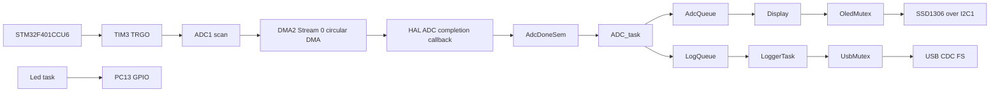

# ADC_OLED System Architecture

## System Architecture

The application initializes STM32 HAL peripherals, creates CMSIS-RTOS2 objects, and starts the FreeRTOS scheduler. `ADC_task` owns ADC/DMA startup and converts DMA completion into queued application data. `Display` and `LoggerTask` are independent consumers for the OLED and USB paths. `Led` provides an independent periodic GPIO activity task.

## Task Architecture

| Task | Source function | Role |
|---|---|---|
| `defaultTask` | `StartDefaultTask` | Exits immediately. |
| `ADC_task` | `startADC` | Starts acquisition, waits for conversion completion, and publishes samples/log records. |
| `Display` | `StartDisplay` | Consumes ADC samples and updates the OLED. |
| `LoggerTask` | `StartLogger` | Initializes USB CDC and transmits queued log records. |
| `Led` | `StartLow` | Toggles PC13 using a 500-tick periodic deadline. |

## ADC DMA Data Path

TIM3 generates an update trigger. ADC1 performs four regular conversions in rank order: channel 4, channel 1, channel 2, and channel 3. DMA2 Stream 0 copies the halfword results into `adc_values[4]` in circular mode. The DMA interrupt reaches the HAL handler, which invokes `HAL_ADC_ConvCpltCallback()`. That callback releases `AdcDoneSem`, allowing `startADC()` to copy the buffer and enqueue an `AdcMessage_t`.

## OLED Data Path

`Display` blocks on `AdcQueue`. After receiving a sample, it formats the four values, takes `OledMutex`, clears the SSD1306 framebuffer, writes `ADC Monitor` and the sample line, then calls `ssd1306_UpdateScreen(&hi2c1)`. The driver sends commands and page data using `HAL_I2C_Mem_Write()` on I2C1.

## USB CDC Data Path

`startADC()` formats each completed sample as an `ADC: ...` log record and sends it to `LogQueue`. `StartLogger()` initializes the USB device, receives log records, takes `UsbMutex`, and retries `CDC_Transmit_FS()` while the CDC endpoint is busy, with a 500 ms timeout. The CDC receive callback re-arms the receive buffer but does not process incoming data.

## RTOS Synchronization

- `AdcDoneSem`: callback-to-task signal for ADC sequence completion.
- `AdcQueue`: ADC sample transport from `ADC_task` to `Display`.
- `LogQueue`: formatted log transport from the ADC path to `LoggerTask`.
- `OledMutex`: protects OLED initialization and updates.
- `UsbMutex`: protects CDC transmission.

The source does not use event flags, task notifications, or application critical sections.

## Resource Ownership

`ADC_task` starts ADC DMA and TIM3. `Display` is the application user of the SSD1306 driver and I2C1. `LoggerTask` is the application user of the USB CDC transmit path. `Led` is the application user of PC13. The ADC DMA callback only releases the semaphore; it does not copy or format data in interrupt context.

The repository does not define a separate formal ownership abstraction beyond the mutexes and task code described above.
